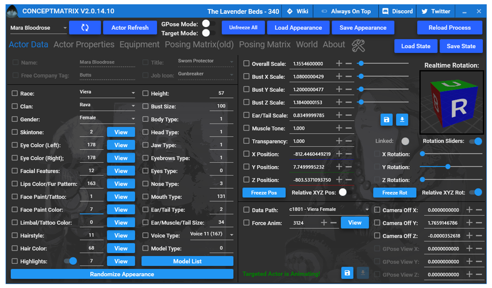
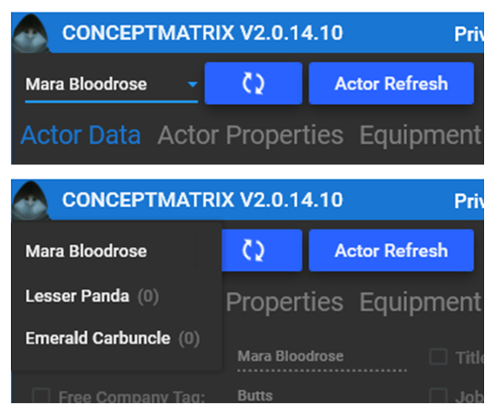
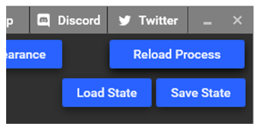
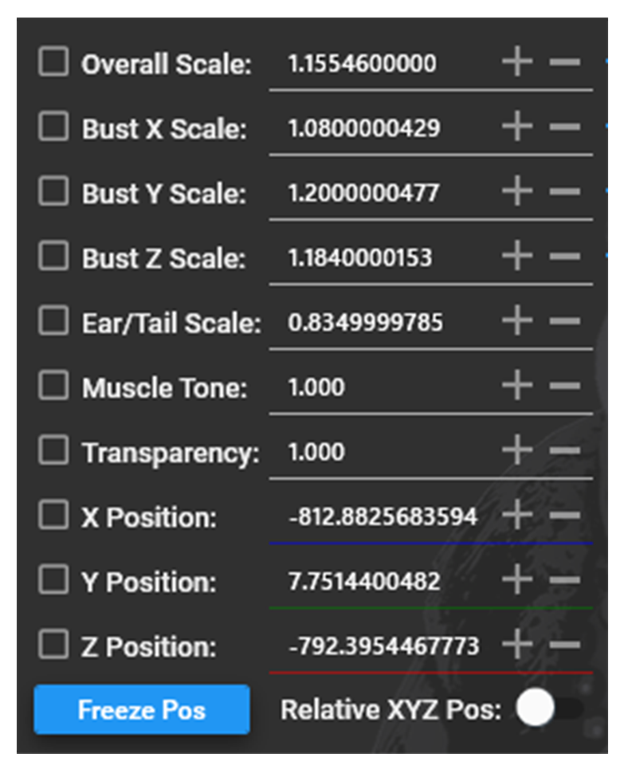
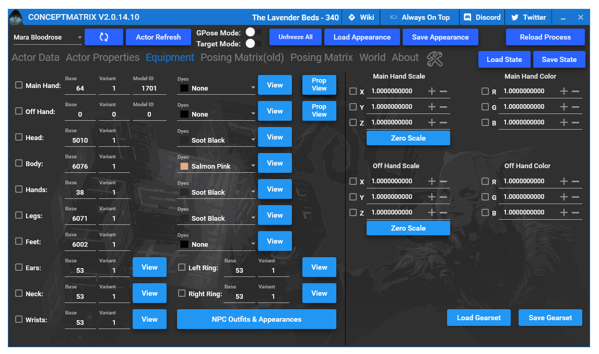
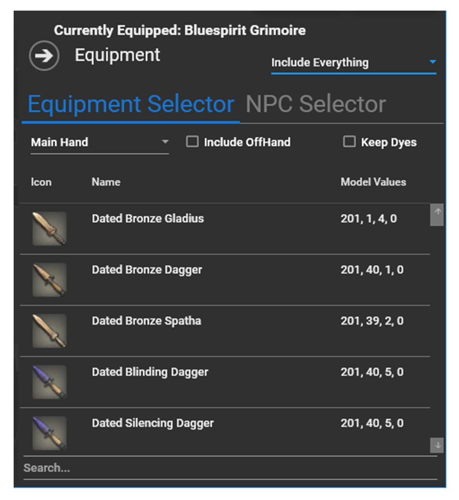
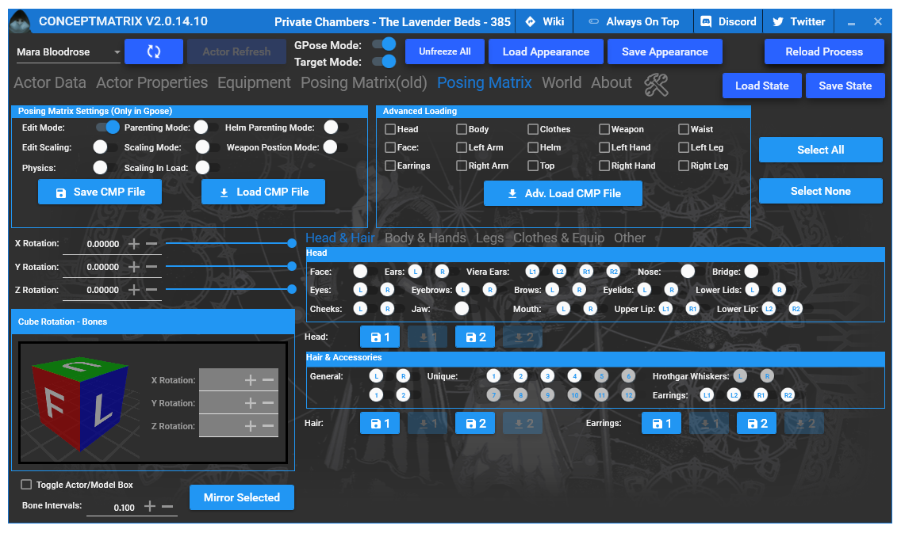
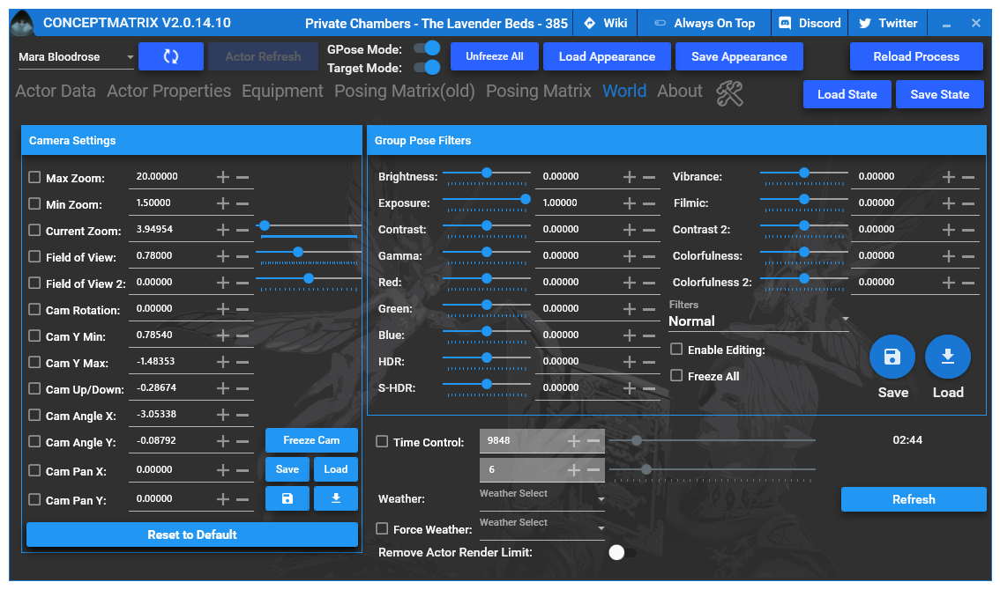

{.shadowed}

## Summary

Feature | Supported
--|--
Vanilla Photo Mode | Yes
Hotsampling | Yes
DSR | Yes
Custom Aspect Ratios | Yes
Reshade | Yes (DX11)
Ansel | No
DirectX versions | DirectX 11
 
## Tools

* [Concept Matrix](https://github.com/imchillin/CMTool)  
**Features**: GPose/Photo Mode Enhancements, FOV Control, Time of Day Control, Weather Control, Custom Character Poses and a lot more...

## The Basics

### GShade/Reshade

[GShade](https://gposers.com/gshade/) is whitelisted for Final Fantasy XIV.
It is basically Reshade but comes with a lot of user created presets and its own installer.
If you know how to use Reshade, GShade won't be much of a challenge, keep the installed shaders and presets if you like to or replace them with your own. 
All depth related shaders work perfectly fine.

### GPose

This is your photomode, you will use it with and without concept matrix, it delivers the basics you have to work with.
I won't cover every aspect of GPose since some are simply useless. You most likely won't ever use them to be honest.
GPoses uses an Orbital Camera, the position of your character is the center from where you can work to the left, right, up and down.
The use of a Controller is recommend for smoother adjustments but not needed.

On Top of the settings window you'll find a small row of self explanatory buttons.
The most important one i will mention here is "Disable/Enable all motion", which lets you pause your characters animations (pets and minions too).
To the left you find tabs with various sections, you can also save and load light and camera setups.

#### General Settings
You can zoom in and out, tilt your camera, look up and down, left and right as well as adjust the FoV to some extend.
Additionally you have Color Filters, Screen Effects, Depth of Field, Limb Darkening (Vignette).
Camera movements are still available even if you switch to another tab.

#### Effect/Frame Settings
It offers status effects like freeze, you can also make your attire look wet.
There is also a frame and sticker mode available.

#### Lighting
You are able to spawn 3 custom lights, adjust their colors as well as pick a type.  
Type 1 is usually the one you pick for portraits, its a softer tone that doesn't spread across the whole area.  
Type 2 and 3 tend to be useless in most cases.  
You are also able to adjust character lighting (counts for every character not just your own) with a simple slider at the bottom.

#### Motion Settings
You can chose from a selection of default animations like walk or run forward. You can pause these with the function mentioned above (Also works on mounts on ground or in the air). 
Some lip movements are available if you like to use them. 
Most important are Emotes, you start the game with a large set of them but you can collect a massive amount of them throughout the game, each can be used in GPose too.  
You can find the full emote collection and where to find them [**here**](https://ffxivcollect.com/emotes).

#### Character Display Settings
Pretty much self explanatory, you are able to show and hide all sorts of things like other players, their pets and minions etc.

### Concept Matrix (CMT)

To enhance your overall GPose experience you can use 2 available tools.  
**Concept Matrix** is very polished and offers a huge variety of tools to use.  
**Anamnesis** is in development but will eventually replace Concept Matrix.

I will cover Concept Matrix's most important parts for you.

When you start Concept Matrix it will automatically hook to the game and your character.
Let's cover each available tab one by one and what it can do for you.

#### Actor Data:
By default, it shows all of your character settings.

{.shadowed .autosize}

Here you can modify your look if you like to. If you change a value, make sure you click the square next to the desired value, otherwise it will just change back to what it was.
All settings to the left require you to press "actor refresh" to see the changes in-game. 

On the top left you find your character name, if you click on it, it will open a drop down list "if" there are other entities around you. 

{.shadowed .autosize}

(Important: If you switch to a different zone and/or summon a pet or minion, they won't automatically appear in this list, you have to click on "reload process" once, you can find this button to the right at the very top.)  

If you select another entity here, you are able to modify it as well. 

{.shadowed .autosize}

Take a look at the "model list" for example, you'll find all sorts of NPC, monster and boss models you can use (they also work on your own character).  
Same rule applies here, to see the changes in-game, press "actor refresh".

{.shadowed .autosize}

The most important things for us in this tab are "overall scale", "X", "Y" and "Z" position. Remember to click the square to keep the values.  

X, Y and Z position can only be used while having all motion disabled. You can freely adjust the position of your character this way. On the other hand, if your character's motion was *not* disabled, it will quickly reset the position to where it initially was.
You are also able to rotate your character by pressing, holding and rotating the cube.
All settings to the right are applied in real time.

{.shadowed .autosize}

#### Actor Properties
Pretty self explanatory.

#### Equipment
Here you are able to change your whole attire, only visual changes of course.
By default it shows your current gear and weapons, as well as the applied dyes.
Again, click the square to keep the values. Press "actor refresh" to see the changes in-game.
You can save your favorite outfits you have created by clicking on "save appearance" at the top of your main window.

{.shadowed .autosize}

If you want to modify your attire, simply click on "view" in the desired slot and a huge list of items will appear. You can filter items by jobs and role classes in the top right.  
Pick an item from the list and click it once, press "actor refresh" and you'll see it changed in-game.

{.shadowed .autosize}

Important note here, if you play for example samurai and would like to have the sword sheath visible, you have to pick the same weapon for the off-hand as you did for the main-hand.
Otherwise you will just have a blank weapon on your hip.

{.shadowed .autosize}

#### Posing Matrix:
As the name of this tab says, here you are able to build your own custom poses, import user created ones and modify them to your desire.
I will not dive into this because it is simply too much to cover in this guide.
You can find a variety of poses over at https://www.xivmodarchive.com/.

{.shadowed .autosize}

#### World
In here, you are able to adjust the day of time, the position of the moon and adjust the current weather in a zone (some weather effects are still locked to specific zones). Might as well remove the actor render limit too.

Most important are the camera settings, since you are able to extend the limits of gpose by a lot.
Move your camera in-game with your mouse or controller and adjust values from the list at your desire.

**Current zoom:** Your current distance to the character, you can extend this to what ever value you like if you adjust "max zoom" at the top.

**Field of view:** Both sliders do what they say, play around with both to get the results you are looking for. Slider 1 for smaller steps. Slider 2 for bigger steps.

**Camera rotation:** Tilt

**Camera angle X and Y:** Basically the same function as moving the mouse around while holding right click.

**Camera pan X and Y:** A simple extension you can use, because the in-game point of view is quite limited.

{.shadowed .autosize}

## High Resolution Screenshots

FFXIV supports [hotsampling](https://www.framedsc.com/basics.htm#hotsampling) (even to custom aspect ratios) with SRWE.
Unfortunately, the game seems to have limits. I encountered lots of crashes past 6K, so you may have to experiment with resolutions a bit, see how far you can push it without crashing it.
MSI Afterburner with RTSS is recommend for capturing screenshots.

## Useful Links

* [PC Gaming Wiki](https://www.pcgamingwiki.com/wiki/Final_Fantasy_XIV:_A_Realm_Reborn)