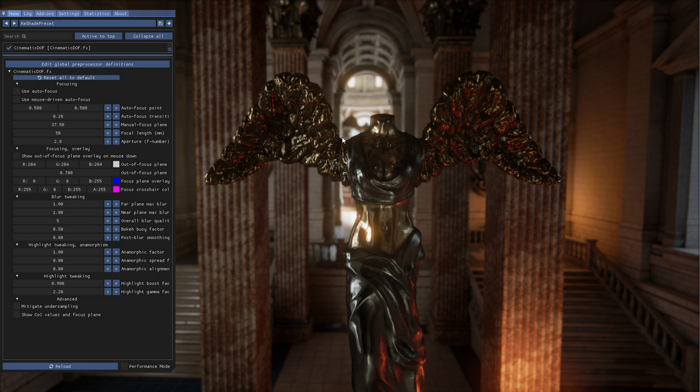
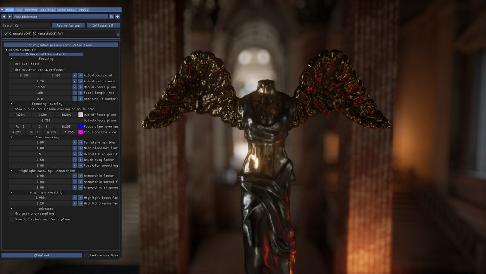
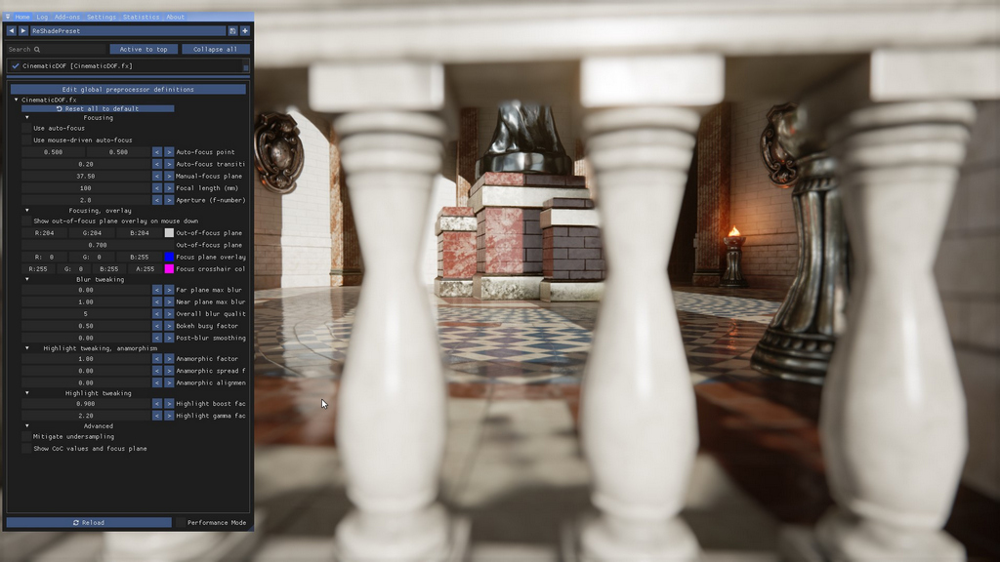
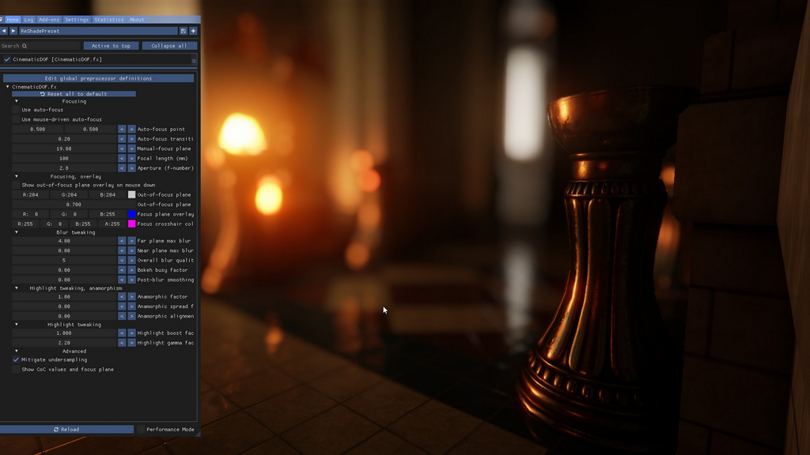
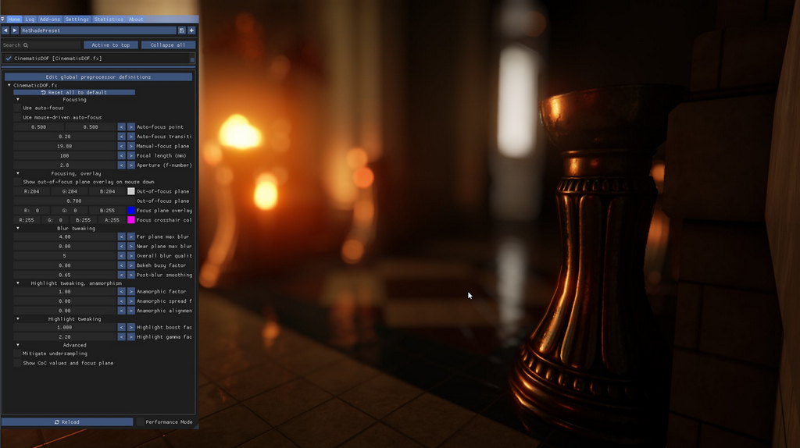
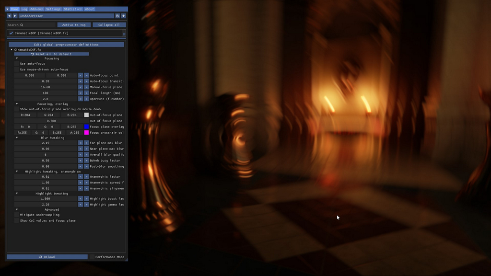

Cinematic Depth of Field
=========================

Cinematic Depth of Field, or 'Cinematic DOF' is a *state of the art* Depth of Field shader for Reshade and is available in the 
[OtisFX](https://github.com/FransBouma/OtisFX) repository. The OtisFX repository always contains the latest version. 

This guide assumes you have [properly set up the depth buffer in Reshade](../setupreshade.htm#checking-depth-buffer-access).
Cinematic DOF is a depth of field shader which works with lens aspects for focusing and blur control. This might at first be confusing 
and this guide should help you understand what the various values mean and what to adjust to get the most out of this shader. 

All settings in the Cinematic DOF shader are drag sliders, which means you can click them, hold the left-mousebutton and drag the mouse
left or right to resp. decrease and increase the value. By holding `shift` while dragging the increase/decrease will go faster. When holding
`ctrl` while clicking gives you the ability to type in the value you want. 

@alert info
The screenshots below are taken with Cinematic DOF v1.2.5, released on March 28th, 2022.
@end

## Focusing
One of the most important parts of a depth of field shader is to focus on the right element in the 3D world. By default, the 
shader has its focusing mode set to *auto-focus* and *mouse-driven auto-focus*. This means that if you mouse the mouse over the scene, the 
element that's below the mouse pointer will be the element the shader will focus on. Everything in front of it and behind it will be blurred.

This works for some situations, however if you want to set up the shot and alt-tab to a tool to increase the resolution of the screen for instance,
you'll lose your focus point. For those situations it's better to switch to *manual focusing*. To do so, simply **uncheck** the *Use auto-focus*
option in the Cinematic DOF settings in the Reshade menu. 

When you switch to *manual focusing*, the shader will focus on a certain *distance* away from the camera. What that distance is, is specified in the
**Manual-focus plane** slider. To change the value, simply drag in the textbox till it has the value you want. 

### Distance to the camera
The element you have in-focus has a certain distance to the camera. The closer it is to the camera, so the closer the *focus plane* is to the camera, 
the stronger the blur will be in the out-of-focus areas. 

### Focusing overlay
Cinematic DOF has an important focus helper, its *out-of-focus plane overlay*. When the **Show out-of-focus plane overlay on mouse down** is checked,
the shader will show an overlay every time the left-mousebutton is pressed and held down. The overlay consists of three colors: white for far plane 
(the area behind what's in focus) out of focus elements, red for near plane (the area in front of what's in focus) out of focus elements and a blue
line for what's exact in focus. 

It also displays the *hyperfocal* area without any color, right next to the blue line. This area is considered 'in focus' 
but transitions slowly to 'out of focus'. When *auto-focus* is enabled, it will display a crosshair when the left-mouse button is pressed, with the auto-focus
point at the center of the crosshair. 

It's recommended you use this option when setting up what to focus on. 

### Focal length and aperture
Cinematic DOF's focusing system is based on three elements: distance of focused element (focus plane) to the camera, the lens length (focal length) and the 
aperture. The distance to the camera is controllable by moving the camera closer to the subject (and with that re-focusing on the element in the 3D world 
you want to focus on). That leaves the focal length and the aperture. 

For lens length, it in general means the longer the lens, the narrower the Field of View (FoV) and the more blur you'll get in out-of-focus areas. For aperture
in general it means the lower the value, the more open the lens will be, so the more light will come into the lens/camera, and with that the more blur you'll 
get in out-of-focus areas. For the Cinematic DOF shader, the two parameters are basically doing the same thing, as the shader itself doesn't control the amount of
light coming into the camera. 

So what values should you pick? To get started, let's look at the defaults the shader comes with: 100mm for Focal length and 2.8 for aperture. If you'd use
a 100mm lens on a modern camera with aperture 2.8 you'd get nice portrait shots with a nice shallow depth of field and nice background blur. 

Here's the default setting in action:

{.shadowed .autosize}

Look carefully at the blurring on the wings of the statue, and the thick blurring in the background. 

If we change the lens and aperture to the values of a lens that's often sold with a modern camera, a 50mm lens with aperture 5.6, the results are a bit different:

{.shadowed .autosize}

You can clearly see there's way less blur in the background. The focus is still on the statue, camera is still on the same distance. Also the blurring on the wings is gone, 
they're cleanly in focus.

Here's the same scene with a lens of 100mm and aperture of 5.6:

{.shadowed .autosize}

And with a 50mm lens with aperture 2.8:

{.shadowed .autosize}

There's subtle more blur than with a 5.6 aperture. You're free to choose what will give you the right blur factor. It's often only necessary to change one the 
two, either lens length *or* aperture, but not both. To get started, leave the aperture on 2.8 for now and only change the lens length to a lower value for less blur 
and a higher value for more blur. 

@alert Tip
Moving the camera closer to the focused element also makes the blur be more prominent (and you have to change the manual focus plane if you're using manual focusing)
@end

## Blur tweaking
After you've set up the focus, the lens length and aperture, you can now tweak the blur of the near plane (in front of what's in focus) and the far plane (what's behind
what's in focus). Additionally you can change the quality of the blur and apply a post-blur smoothing factor to iron out any undersampling artifacts you might see. 

Let's see what these look like. We'll use the defaults of 100mm and aperture of 2.8

### Far plane blur
First we have *Far plane max blur*. Here you can tweak the blur strength given by the lens length + aperture + distance combination. A value of 1.0 gives the 
default blur for that combination. A value of 0 totally switches off bluring for the far plane. If you set the value to a high value, e.g. 3.0, you get excessive
blurring as seen in the shot below.

Far plane max blur set to 3.0:

{.shadowed .autosize}

If we change the blur to a lower value, e.g. 0.5, we'll get the result below:

{.shadowed .autosize}

This might look the same as using a shorter lens, like 50mm, but that's not the case: with a 50mm lens the blur starts later, deeper into the 3D world, farther away from 
the focus plane. With 100mm the blur starts already on the wings of the statue. Because the blur factor is set to a lower value, the blur is very subtle. 

### Near plane blur
Additionally you can tweak the blur for the *near plane*. The near plane is blurred with a soft edge to make it realistic. The same applies to the near plane blur as 
for the far plane blur: setting it to 0 switches it off, setting it to a high value makes the blur extremely prominent. 

Below an example shot where the focus is on the statue and far blur has been disabled, using the default near plane blur factor of 1.0.

{.shadowed .autosize}

### Overall blur quality and smoothing factor.
The overall blur quality is by default set to 5. This is the # of rings the shader will use per pixel to produce the disc-based blur. The higher the number, the more
rings and therefore the more samples it will take per pixel to blur the areas in the near and far plane. The value 5 gives overall good quality results and high performance
but if you want higher quality, you can, the range goes to 12. The higher the number, the more performance the shader will take. 

A high quality number is in general only needed for highlights. In normal blurred areas without *bokeh* highlights, you won't notice much difference between e.g. 4 or 9.
However with a scene with a lot of bokeh highlights, you'll notice *dots* with low quality settings in highlights, if the blur factor is high enough. This is a side effect
from a phenomenon that's called *undersampling*. 

See the following scene: 

{.shadowed .autosize}

It has the quality set to the default, 5, and a high blur factor and no undersampling mitigation. The focus is on the metal pillar in the from right. 
You can see some dots in the bokeh highlights in the middle-left, so the highlights are *undersampled* here. 
We can increase the blur quality to a higher value to get rid of this side effect, or check the 'Mitigate undersampling' checkbox in the *Advanced* section. 

{.shadowed .autosize}

We can also achieve that with another option, the **Post-blur smoothing factor**. This setting applies a gaussian blur on the near and far plane to smooth out the 
highlights. It's a less subtle option than the quality setting, but the performance is better. 

In the shot below the undersampling mitigation is switched off, and the smoothing factor is used to get rid of the undersampling artifacts instead.

{.shadowed .autosize}

Not all artifacts are gone though: bokehs with low brightness are skipped to avoid blurring non-highlight areas. It's a trade-off and it's up to you what to use
in a particular scene.

## Highlight tweaking
A depth of field effect creates *bokeh* highlights, of which we've seen an example of in the previous section. 
To help the shader get proper bokeh highlights, Cinematic DOF has a variety of settings which can help you create the bokehs you want. 

### Busy Bokeh factor
A bokeh highlight is a typical round highlight with an even color. However you can change the round highlight to be a circle which is more transparent in the center
than it is on the edges. To do this, increase the **Busy bokeh factor** to a value bigger than 0. The example below shows the highlights with a factor of 0.5.

{.shadowed .autosize}

### Highlight boost factor
There's a **Highlight boost factor** setting for boosting the highlights a bit. 

{.shadowed .autosize}

However if we crank the Highlight boost factor to 1.0, we get a totally different scene:

{.shadowed .autosize}

There's also a gamma factor which boosts all pixels a bit. In general you should leave it at its default value, 2.2, but it could help in dark scenes. 

## Anamorphism control

There are various lens effects known from cinema, one of them is anamorphic bokeh shapes, which means the bokeh shapes don't form perfect round circles around edges but
ellipses. This effect is caused by using a lens to project a wider image onto a narrower lens opening, resulting in vertical ellipses. Cinematic DoF offers 
this feature and adds additional options to distort the ellipses to mimic edge distortion as well. These three settings are combined in the Anamorphism control section
in the shader controls. 

### Anamorphic factor
The first factor is the factor to control the amount of the anamorphism of the bokeh shapes, the **Anamorphic factor**. By default it's 1.0, which means all bokeh shapes are 
fine round circles. Moving the value down to 0.0 will make them appear more and more like elipses. Below is an example of a scene with an anamorphic factor of 0.7. 
It shows slight deformation around the edges, but close to the center the shapes are still round. This can be used to mimic edge distortion in fisheye lenses.

{.shadowed .autosize}

### Anamorphic spread factor

The default spread factor makes the anamorphism appear to the edges, not in the center. To make it show up evenly everywhere, you can increase the **Anamorphic spread factor**
to a value higher than 0.0, with 1.0 being the factor where the anamorphism is applied everywhere evenly. An example of that is given below.

{.shadowed .autosize}

### Anamorphic alignment factor

The **Anamorphic alignment factor** is the factor that gives us the classic anamorphic effect of vertical ellipses: using a value of 1.0 the ellipses are aligned
vertically like with a classic anamorphic lens. If you use a value lower than 1.0, the ellipses are rotated around the center, 
with a value of 0.0 being the alignment we've seen in the previous shots. An example of having the setting set to 1.0 to get the classic anamorphic lens behavior 
can be seen below.

{.shadowed .autosize}

### Go wild

You can get vortex swirlies if you want:

{.shadowed .autosize}

